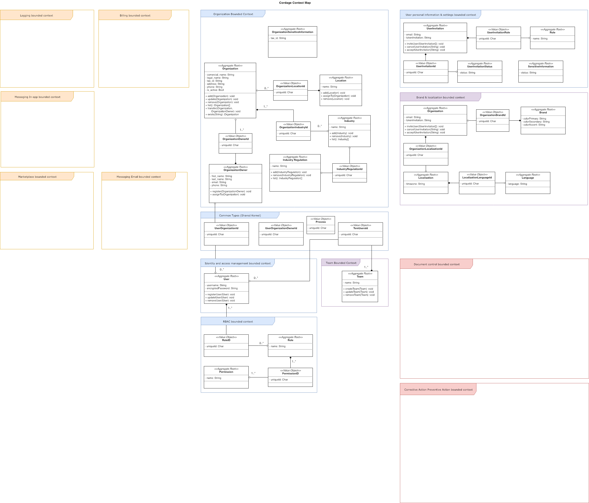

## Context Map Diagram

**Note**: *All the documentation of aggregates, aggregates, root, entities, value-objects, projections, projectors, can be found in the repository of each context. Said documentation will be generated with ExDocs of Elixir*

*Powered by Draw.io* 
